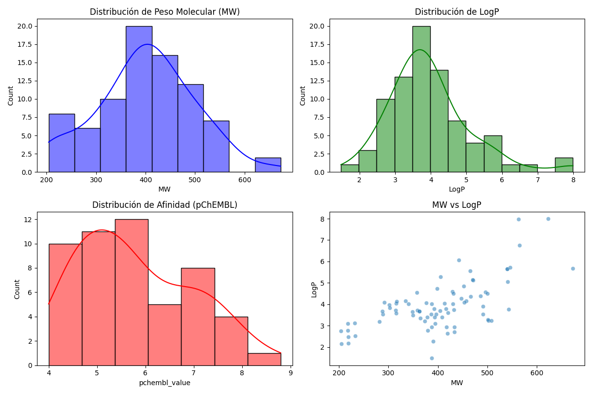

# 🧬 Neuro-Synthetix: Autonomous Drug-Target Discovery
**30-Day MLOps Challenge | From Chemical Engineering to AI Science**

[](https://www.python.org/)
[](https://mlflow.org/)
[](https://pytorch-geometric.readthedocs.io/)
[](LICENSE)

## 📌 Project Overview
**Neuro-Synthetix** is an end-to-end MLOps platform designed to accelerate the discovery of new drug candidates. Using **Graph Neural Networks (GNN)**, the system predicts the binding affinity between chemical compounds and the **EGFR (Epidermal Growth Factor Receptor)**, a critical protein target in oncology research.

This project bridges the gap between **Industrial Process Engineering** and **Artificial Intelligence**, implementing a robust, reproducible, and scalable pipeline that covers everything from raw chemical data ingestion to physics-based validation.

---

## 🏗️ System Architecture


The platform is built on four fundamental pillars:
1.  **Data Engineering:** Automated ingestion from ChEMBL and chemical curation (Salt removal/Canonicalization) using RDKit.
2.  **MLOps Infrastructure:** Experiment tracking with MLflow and data versioning with DVC to ensure 100% reproducibility.
3.  **Graph Deep Learning:** Molecular representation as graphs, where atoms are nodes and bonds are edges, processed via PyTorch Geometric.
4.  **Scientific Validation:** Integration of Molecular Docking to verify the physical feasibility of AI-generated predictions.

---

## 🚀 15-Day Roadmap

| Phase | Status | Goal | Key Technologies |
| :--- | :---: | :--- | :--- |
| **1. Data Engineering** | 🟡 | Ingestion, Curation & EDA | RDKit, ChEMBL API, DVC |
| **2. MLOps Core** | ⚪ | Model Training & Tracking | PyTorch Geometric, MLflow |
| **3. Validation & API** | ⚪ | Docking & FastAPI | AutoDock Vina, Docker |
| **4. Advanced AI** | ⚪ | XAI & Active Learning | SHAP, ChromaDB, LLMs |

---

## 🛠️ Daily Progress Log

* **Day 1:** Project initialization, environment setup (`conda` + `pip`), and modular architecture design.
* **Day 2:** Implemented `fetch_data.py`. Automated ingestion of **EGFR** bioactivity data (IC50) from the ChEMBL API.
* **Day 3:** Implemented `curation.py`. Applied chemical cleaning techniques: salt removal, SMILES canonicalization, and structural deduplication using **RDKit**. 
    * *Result:* Cleaned the dataset to ensure the model learns from active organic scaffolds, not preparation artifacts.
* **Day 4:** `eda.py`. Scientific EDA and **Lipinski's Rule of Five** validation.
    * *Insight:* We analyzed the compounds’ drug-likeness (MW, LogP, HBD, HBA) to ensure the model learns from molecules with real pharmacological potential.

---

## 📊 Methodology & Engineering Standards
In the pharmaceutical industry, "garbage in, garbage out" can lead to massive losses. By implementing **Salt Removal** and **Canonicalization** at the early stages, we ensure:
* **Data Integrity:** Removing inorganic ions (Na+, Cl-) that do not contribute to binding affinity prediction.
* **Uniqueness:** Ensuring that each chemical structure is represented by a single, unique SMILES string to prevent data leakage during training.

---

## 📊 Scientific Insights (Day 4)
To ensure data quality, we validated the physicochemical properties of our processed dataset:




**Key Metrics Tracked:**
* **Molecular Weight (MW):** We identified the optimal molecular size range for crossing cell membranes.
* **LogP:** We measured lipophilicity to ensure bioavailability.
* **pChEMBL Value:** Our target variable (logarithmic binding affinity).

---

## 🔧 Installation & Setup

1. **Clone the repository:**
   ```bash
   git clone [https://github.com/mpenalab/neuro-synthetix.git](https://github.com/mpenalab/neuro-synthetix.git)
   cd neuro-synthetix
   ```

2. **Set up the environment:**
    ```bash
    conda create -n neuro-synthetix python=3.10
    conda activate neuro-synthetix
    pip install -r requirements.txt
    ```

3. **Reproduce the pipeline:**
    ```bash
    python src/ingestion/fetch_data.py
    python src/processing/curation.py
    ```